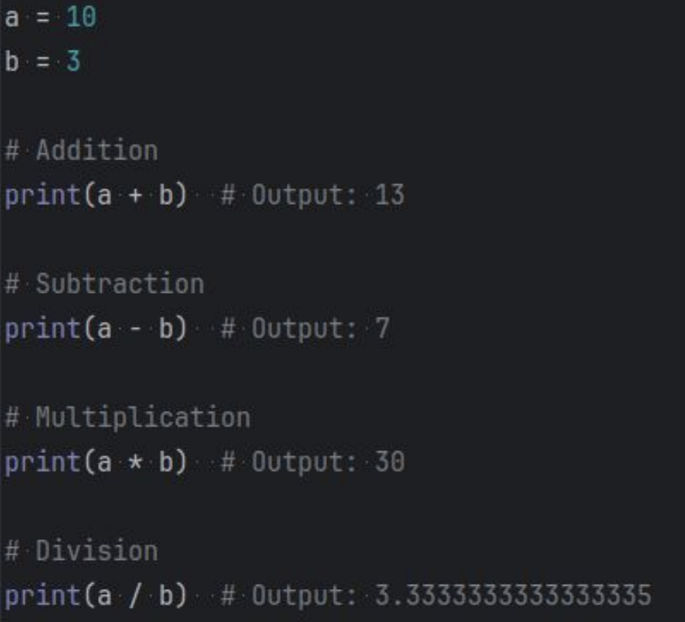
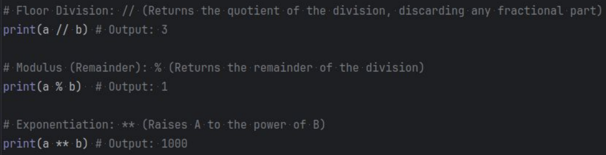
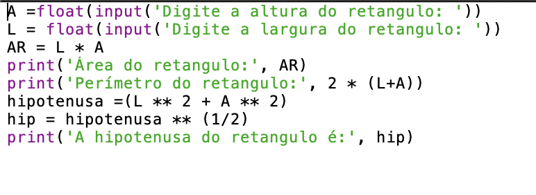

# Notas Aula 16/04/2024
  
 - **snake_case:** Variáveis sempre com letras minúsculas, separadas e com '_' se precisar separar. Ex: user_name.

 - **Constantes:** Sempre com letras MAIÚSCULAS. Ex: PI_VALUE.

 - **None:** Quando algo não vale nada, que é diferente de 0. Ex: None != 0
 - **Lista:** Coleção ***mutável*** e ordenada de itens. Ex: a = [1,2,3]
 - **Tupla:** Coleção ***Imutável*** e ordenada de itens. Ex: a = (1,2,3)
 - **Dicionário:** Conjunto mutável de pares chave-valor. Ex: a = {'name': 'Augusto' , 'city': 'Porto Alegre'}
 - **Conjuntos:** Grupo mutável e não-ordenado de itens únicos. Ex: a = {1,2,3}
 - **Conjuntos Congelados:** Grupo ***não-mutável*** e não-ordenado de itens únicos. Ex: a = frozenset ({1,2,3})
 ## Operadores Matemáticos:
 
 
 - div = //
 - mod = % 
## Atividade: App para Engenharia Civil

