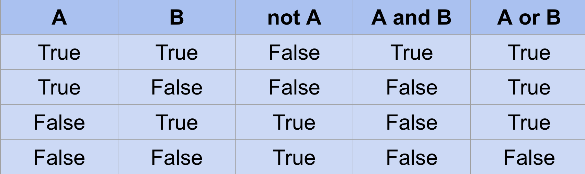
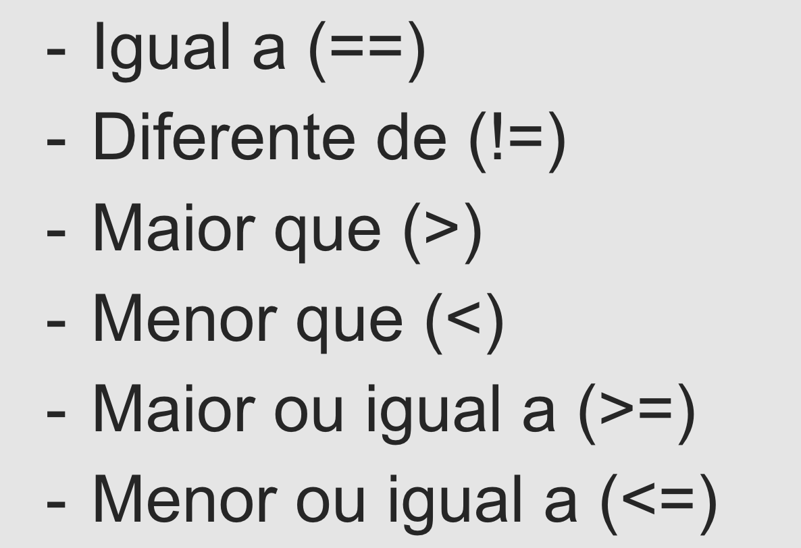
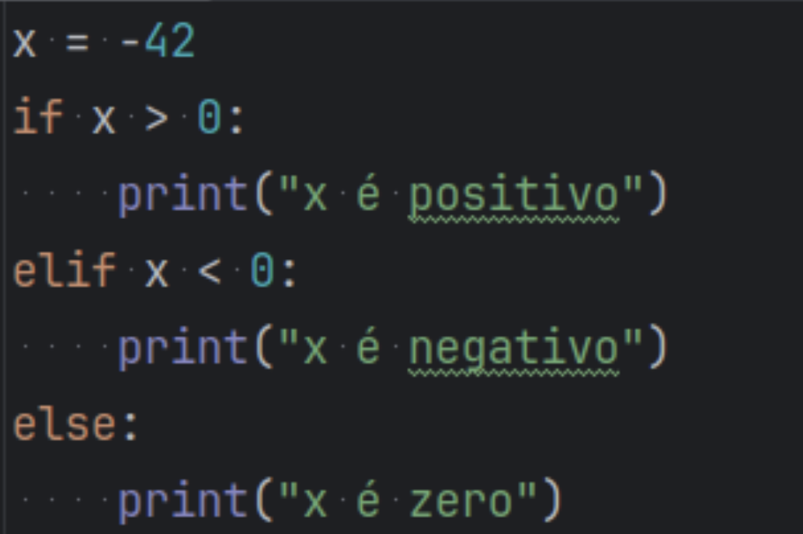
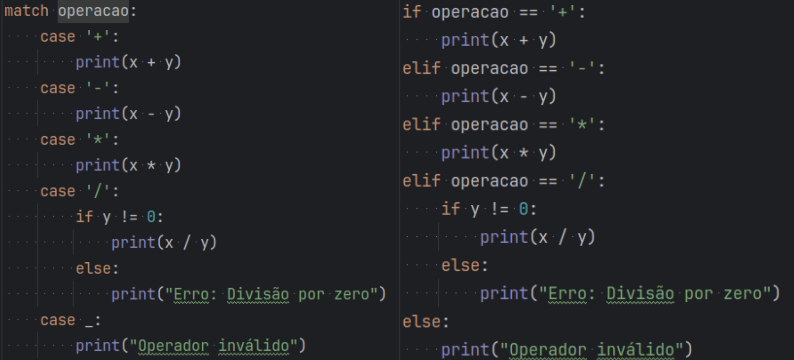

# Notas aula 22/04
 ## Operadores lógicos e condições
  
 ## Operadores relacionais
  
 ## If - Elif - Else
  
## Match-case ou Switch
 - Possibilita fazer múltiplos ‘if’s de forma menos verbosa.
 
 

