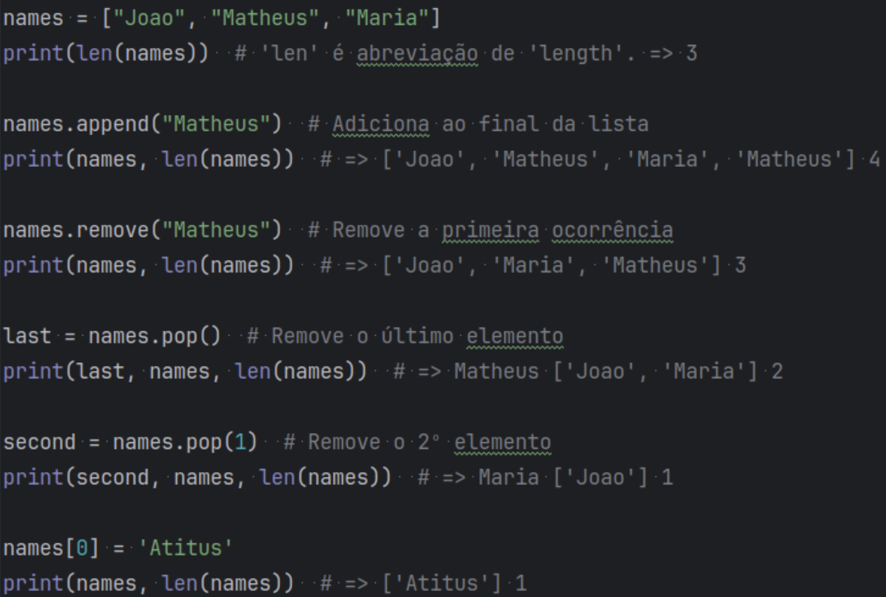
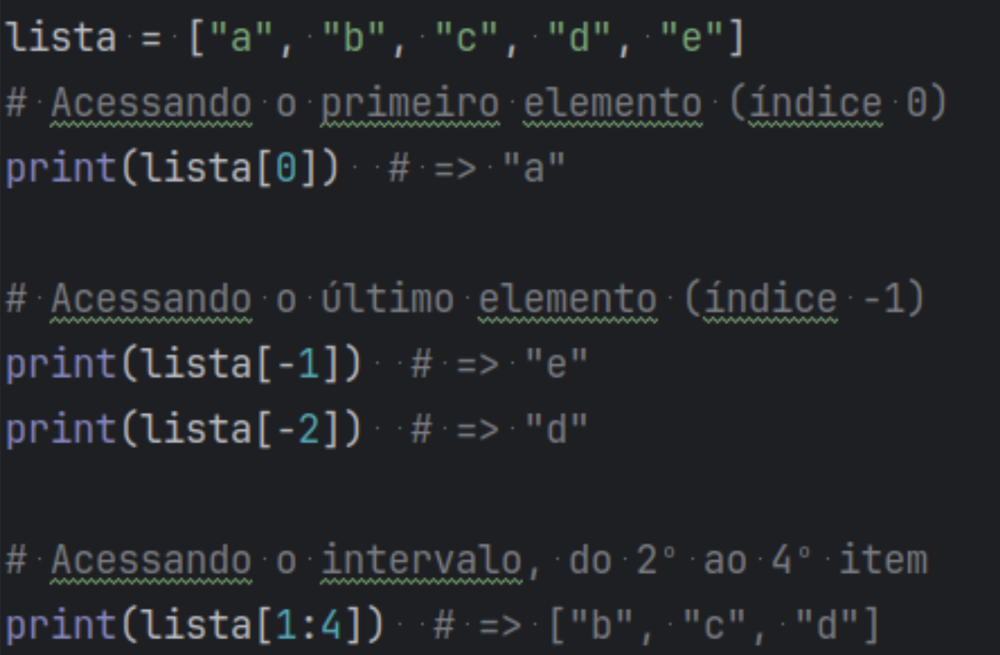
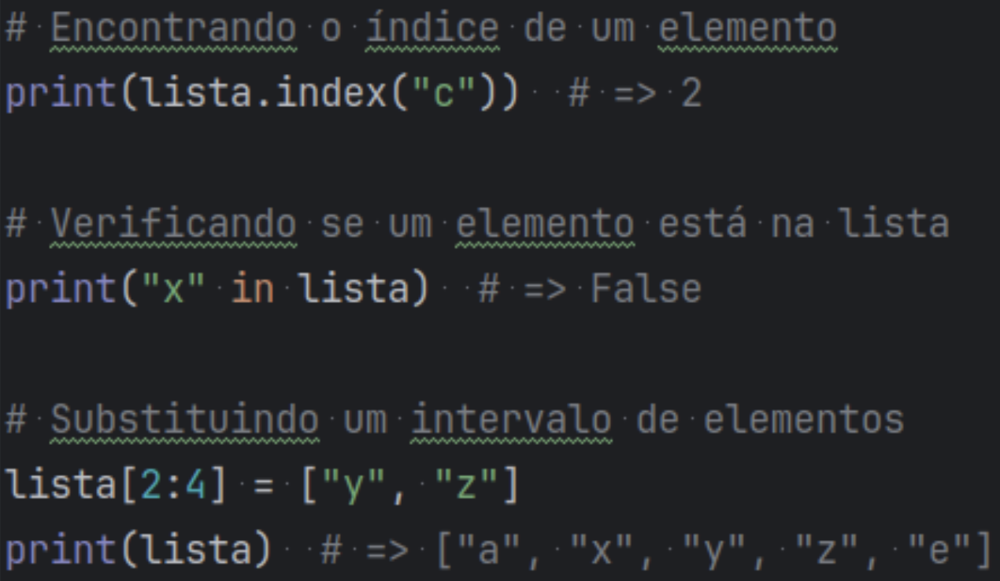
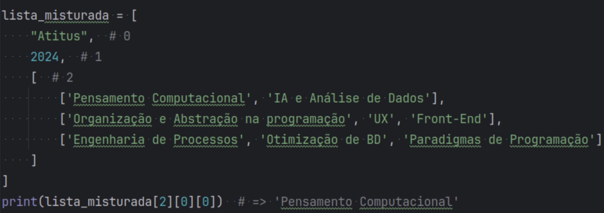
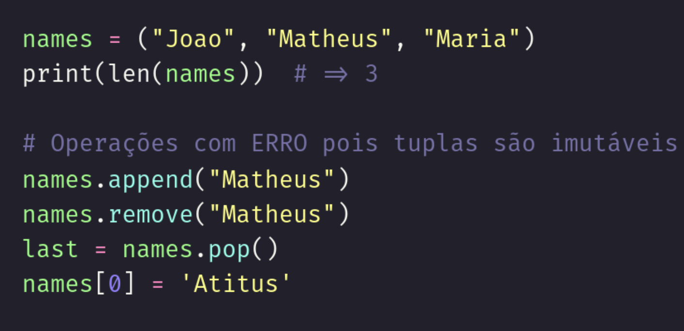
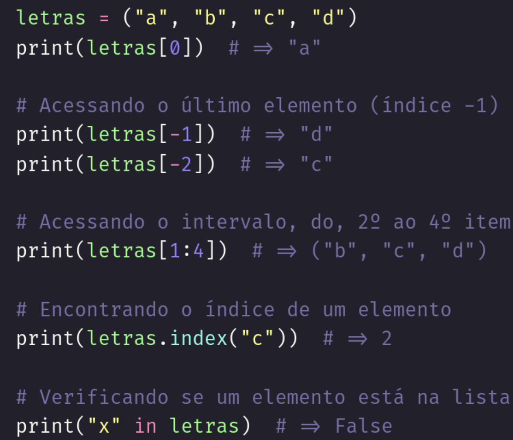
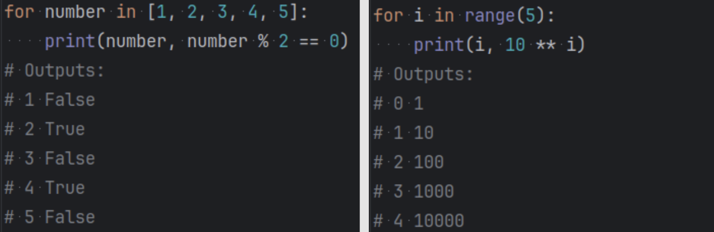
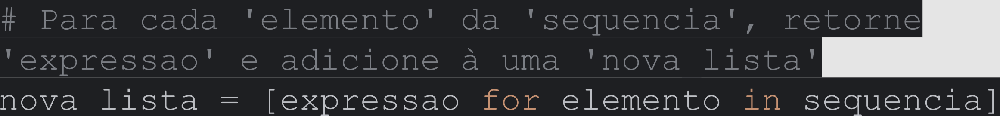
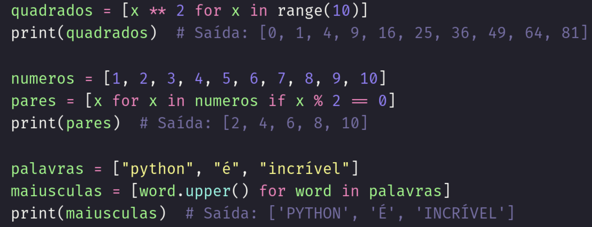

# Notas Aula 23/04
 - Comando dir() para listar as variáveis disponíveis.
 - dir(variável) para mostrar os métodos disponíveis nesta variável.
 ## Listas
 - lista = ['Augusto', 'Matheus', 'Joao']
 - coleções **mutáveis** e **ordenadas** de itens heterogêneos.
 - Armazena números, strings, listas, tuplas...
 
 
 
 
 ## Tuplas
 - tupla = ('Augusto', 'Matheus', 'Joao')
 - coleções **imutáveis** e **ordenadas** de itens heterogêneos.
 
 
## Laços de repetição: For
 - Itera por uma lista de itens, executando o mesmo trecho de código para cada elemento.
 
## While
 - Executa um trecho enquanto a condição for verdadeira.
 
## List comprehension
 - Syntactic sugar similar ao ‘if ternário’, possibilitando operações com listas em uma única linha.
 
 

