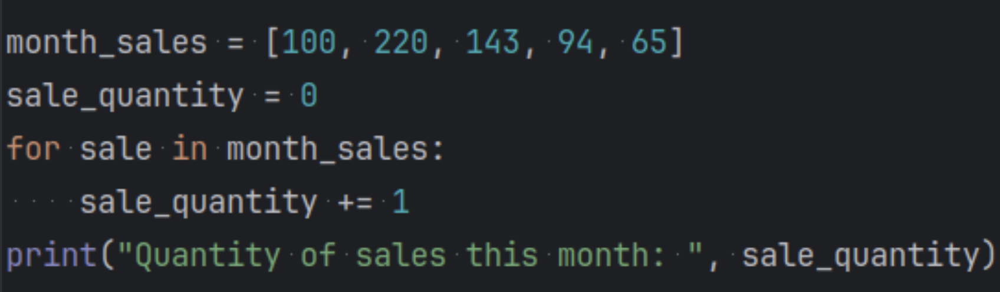
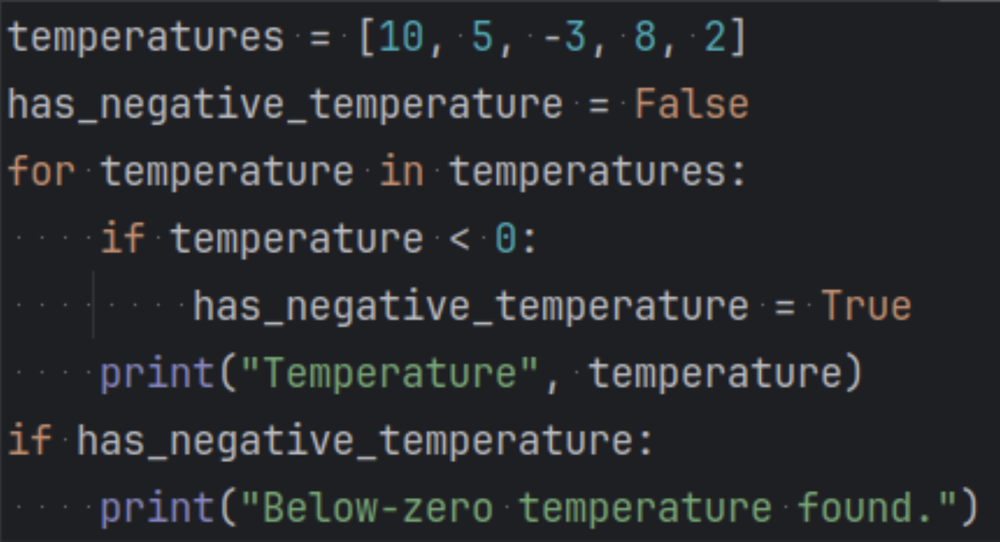
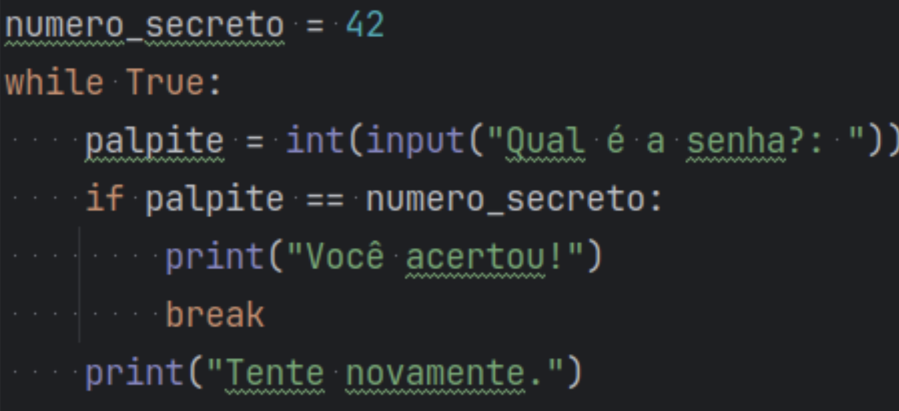
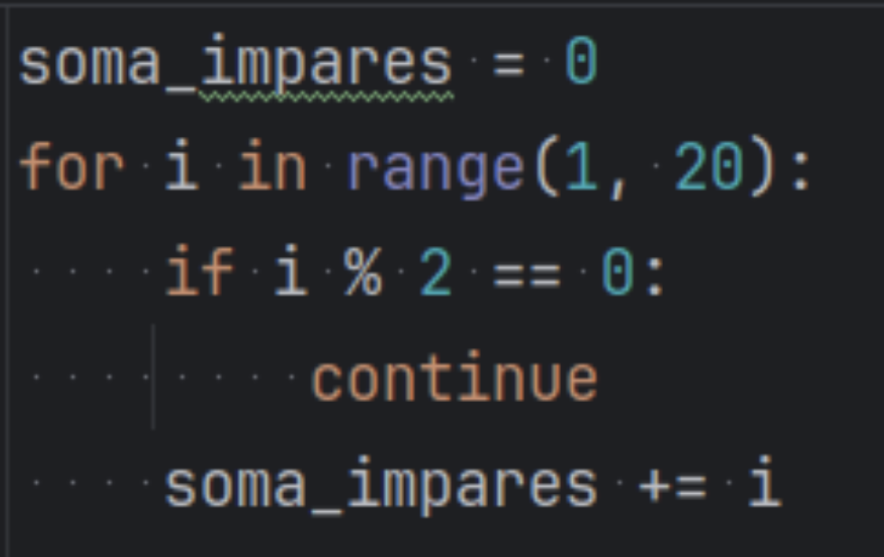

# Notas Aula
 ## While
 - Executa a condição enquanto for verdadeira.
 
 ## Listas aninhadas
 - 
 - 
 ## Break
 - 
 ## Continue
 - 
 ## Comandos IDE
 - Shift + f6 para renomear todas as variáveis.
 - Multicursor, control 2 vezes, na segunda segura.
 - Alt + j para alterar um dado no código todo.
 