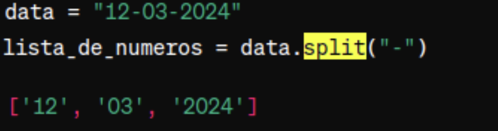

# Aula 29/04 - Manipulação de strings.
 ## f-strings: 
  
 ## Split:
 
 
 ## Slice:
 
 ## Join:
 
 ## Replace:
 
 
 ## Find:
 
 ## Upper, Lower, Capitalize:
 
 ## ASCII
 -  ord()
 
 - chr()
 
 ## Random
 
 